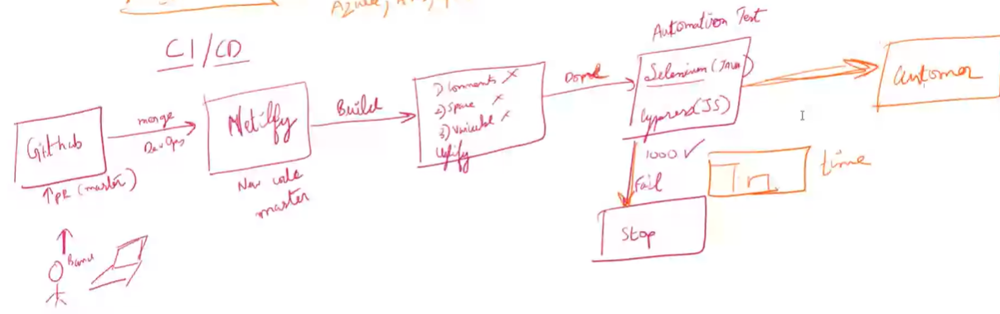

# Git Fundamentals

> some comands used in terminal

- git init  
  To Initialize empty Git repository
- git add .  
  Command used for staged changes
- git reset  
  To unstage the changes
- git commit -m "Type the msg here"  
  This command is to commit the changes with a message
- git status  
  To know the status
- git log  
  To know what are all the commits made till now
  - log filter
    - --author -> filter by author
    - -2 -> last commit
  - -p -> patch
  - -S -> pick-axe - search
  - git log `-S<word>` -p
    - `/<word>` - highlight search
    - `<space>` - page down
    - `n` - next match
    - `N` - prev match

> Git VS Github

Git is a software , whereas github is a place to store the documents or files.  
Git is a Distributed System

- Git has 3 stages:

  1. Working
  2. Staging
  3. Commit

- When u should make a commit ?

  1. When there is a logical change
  2. Commit should be done for small changes
  3. Should commit multiple times a day
  4. Always commit when ur code is working

> VIM

- Verb + Number + Movement

## Stash

used for storing the code temporarily which is incomplete (since we cannot commit code bcoz it is incomplete , we will temporarily store in stash)

## syntax for rebase(interactive)

- git rebase -i HEAD~[mention no.of commits, Ex:3,4 etc](`i` stands for interactive)
- after giving the above command , select the commits which are to be squashed
- next give a message for the combined commit
- to exit rebase : git rebase -- abort

## Rebase

- Rebase is done to maintain the history in a straight line
- Rebase makes to search a particular commit (history) using Binary Search
- This helps to search the bugs very fast (i.e, to know at which place a bug is introduced)
- command for rebase : git pull --rebase origin dev
- to delete a branch locally : git branch -D [branch_name]

## Key Terms:

- Configuration Management

  - Configuration item -> deals with Git files
  - Audit
    - commits -> sign (i.e, records all the details of the developer who commited, what they have commited, and when they have commited)
    - Blame (git blame [file_name]) - this feature will show the details of the developer for every line of code(i.e, it tells who edited the line)
    - git diff
  - Baseline (save point)
    - commits
    - Tags
  - Accounting / Accountability
    - git log
    - git blame
  - Change Management (how efficiently we can manage the changes)
    - Using branches
    - Creating PR(Pull Request)

- Release Management

  - Planning
    - Branching strategy ->(Master, Staging , dev)
  - Governance
    - Talks about authority / Access level of each branch
  - Scheduling
    - Sprints
    - Agile
  - Automation
    - CI/CD (continous Integration & continous Deployment) -> using Netlify
    - No human errors
    - Tools for CI/CD : Netlify , Circle CI, Jankins
  - Contingency plan / backup plan
    - Roll back to the older version

- Key Benefits of Configuration Management:
  - Traceability -> who? why?
  - Code quality and consistency
  - Reduces risks & avoids errors (we have a backup i.e, it is stored)
  - Change Management

## SAAS , PAAS , IAAS

- IaaS, or infrastructure as a service (Ex: AWS, Azure, GCP)
- PaaS, or platform as a service (Ex: Netlify, render.com, railway, vercel)
- SaaS, or software as a service (Ex: all apps & web applications like swiggy , twitter.com , facebook etc)

> CI/CD

- From step github to netlify is CI (continous integration)
- Remaining steps are called CD (continous deployment)
